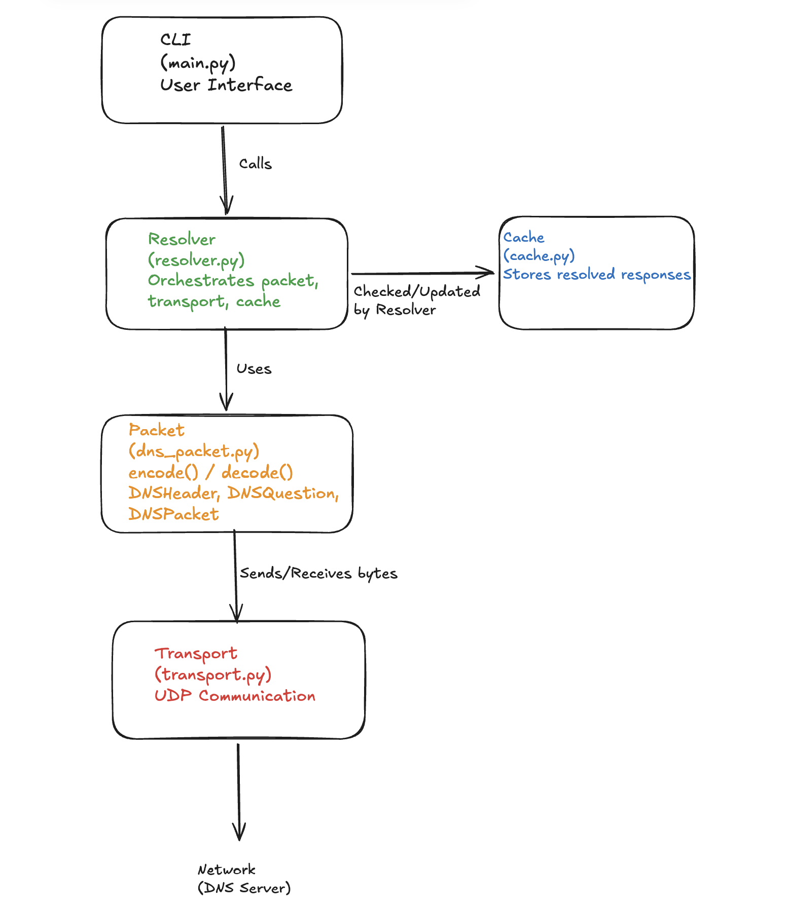

# DNS Resolver


A DNS resolver implemented from scratch in Python using only the standard library, featuring a modular design that demonstrates query handling, packet parsing, and caching across network protocols.

## Overview

This project demonstrates:

- Low-level DNS packet construction and parsing
- UDP network communication
- Modular OOP design
- In-memory caching with TTL

This project also provides hands-on exposure to networking fundamentals, including DNS resolution, UDP communication, and protocol design.

## Architecture



Layers:

1. CLI – handles user input and prints output
2. Resolver – orchestrates queries, caching, and network transport
3. Packet – encodes and decodes DNS packets
4. Transport – sends/receives UDP packets
5. Cache – stores responses for performance

## Tech Stack

- Python 3.9+
- Standard library only

## Usage

```
Bash or Zsh

python -m src.resolver example.com
```

## Status & Roadmap

- Skeleton implemented. First working query in progress.
- Future improvements:
  - Handle recursive queries
  - Support multiple record types (A, AAAA, CNAME, MX)
  - Add persistent caching and logging
