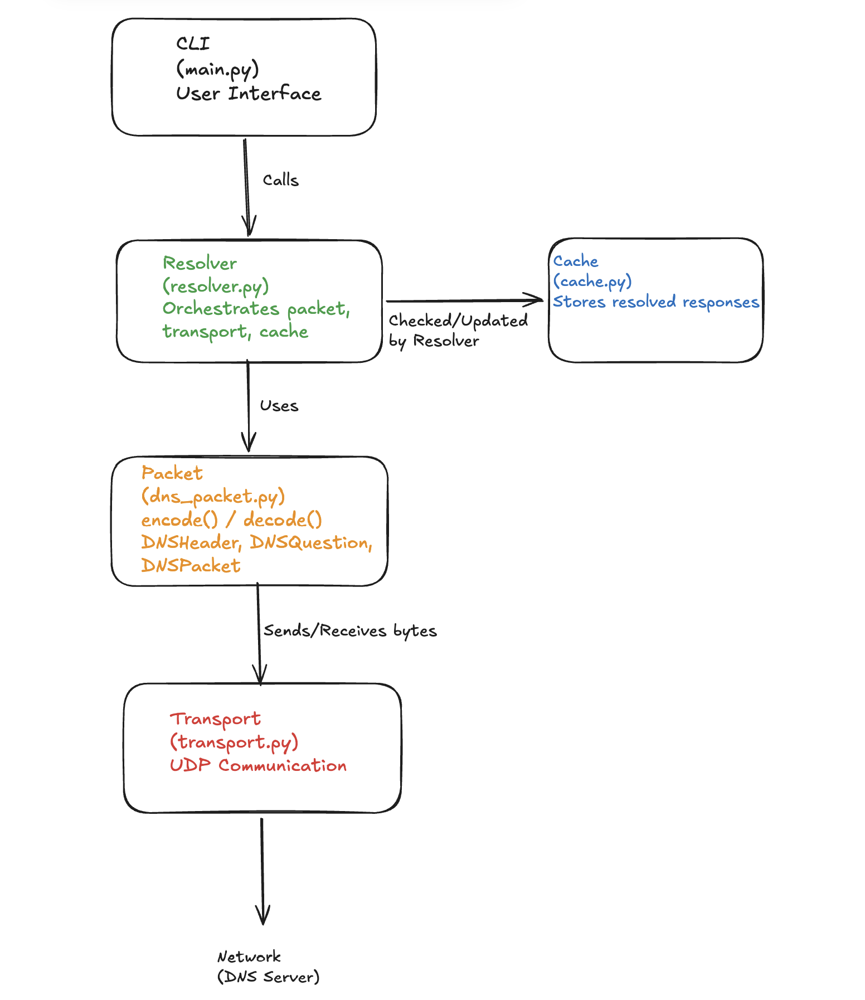

# DNS Resolver


## Overview

A DNS resolver built from scratch in Python using only the standard library. Demonstrates low-level DNS packet construction and parsing, UDP communication, modular OOP design, and in-memory caching with TTL.

## Architecture



Layers:

1. CLI – handles user input and prints output
2. Resolver – orchestrates queries, caching, and network transport
3. Packet – encodes and decodes DNS packets
4. Transport – sends/receives UDP packets
5. Cache – stores responses for performance

## Tech Stack

- Python 3.9+
- Standard library only

## Usage

```
Bash or Zsh

python -m src.main example.com
```

## Status & Roadmap

- [x] DNS packet encoding (DNSHeader, DNSQuestion, DNSRecord)
- [x] DNS packet decoding (DNSHeader, DNSQuestion, DNSRecord)
- [x] Unit tests for encoding and decoding
- [x] Logging setup
- [x] Transport layer (UDP send/receive)
- [ ] Iterative resolver (query a known resolver e.g. 8.8.8.8)
- [ ] In-memory caching with TTL
- [ ] Refactor to recursive resolver (follow referrals from root servers)
- [ ] Support multiple record types (A, AAAA, CNAME, MX)
